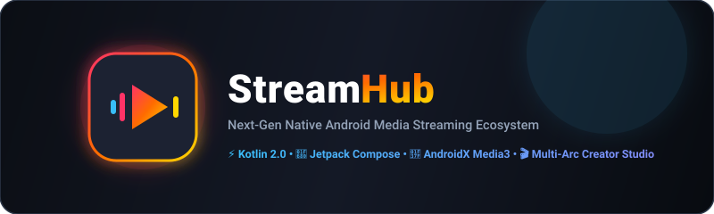
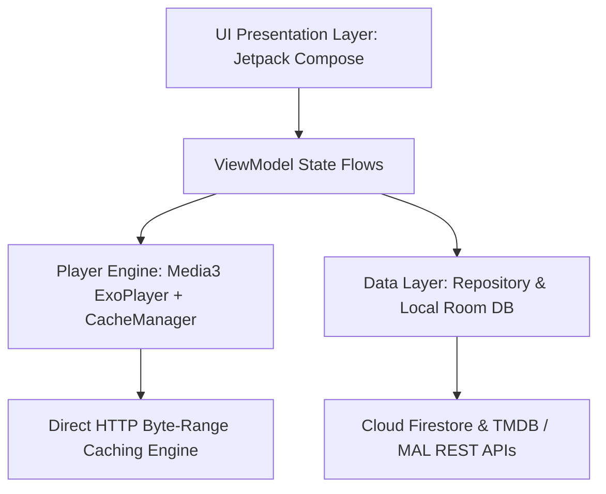

<p align="center">
  
</p>

<p align="center">
  <a href="https://github.com/WorkerOfArea51/StreamHub">
    
  </a>
</p>

<p align="center">
  <a href="https://github.com/WorkerOfArea51/StreamHub"></a>
  <a href="https://kotlinlang.org"></a>
  <a href="https://developer.android.com/jetpack/compose"></a>
  <a href="https://developer.android.com/media/media3"></a>
  <a href="https://firebase.google.com"></a>
  <a href="LICENSE"></a>
</p>

---

## ⚡ Overview

**StreamHub** is a bleeding-edge, high-performance native Android media streaming application built with **Kotlin 2.0**, **Jetpack Compose (Material 3)**, and **AndroidX Media3 ExoPlayer**. 

Engineered from the ground up for low latency, zero-login instant playback, aggressive byte-range disk caching, and a multi-season **Story Arc Creator Studio** with 1-click REST API batch ingestion.

---

## ✨ Key Highlights & Features

| 🚀 Feature | 💡 Description |
| :--- | :--- |
| **⚡ Turbo HTTP Progressive Engine** | Sub-second playback initialization with byte-range requests and automatic multi-gigabyte disk caching (`SimpleCache`). |
| **🍿 Slate Glassmorphism UI** | Netflix & Crunchyroll inspired Jetpack Compose interface with Hero Carousels, fluid category pills, and dynamic ambient glows. |
| **🎬 Multi-Arc Story Hub** | Dedicated Arc-Level episode manager with automatic missing episode gap detection, 1-click F2L REST batch importer, and snippet insertion. |
| **🎧 Dual-Audio & Subtitle Master** | Embedded MKV multi-audio track switcher, external/internal subtitle track selector, and custom audio booster. |
| **📺 Advanced Player HUD** | Double-tap to seek, pinch-to-zoom (`Fit`, `Crop`, `Stretch`, `Fill`), speed controls (`0.5x` - `2.0x`), background audio service, and PiP (Picture-in-Picture). |
| **🏷️ Real-time MediaInfo Badges** | Dynamic resolution and codec badges (`4K UHD`, `1080p FHD`, `x264/AVC`, `HEVC/x265`, `Dual Audio`, `ESub`, `File Size`). |
| **📥 Background Download Manager** | Multi-threaded offline file downloads with progress notifications and local playback support. |
| **🎨 7 Dynamic Accent Themes** | Crimson Red, Cyberpunk Purple, Neon Green, Oceanic Cyan, Electric Blue, Sunset Orange, and Gold with persistent memory. |
| **🔒 VIP Access Gate & Admin Studio** | Private community gate on launch with secret 5-tap gesture unlock for Creator Studio in-app publishing. |

---

## 🛠️ Architecture & Tech Stack



- **Language**: Kotlin 2.0+ (Coroutine-first, Dispatchers.IO isolation)
- **UI Framework**: Pure Jetpack Compose with Material 3 Design Tokens
- **Video Engine**: AndroidX Media3 ExoPlayer (`media3-exoplayer`, `media3-ui`, `media3-datasource`)
- **Metadata Database**: Firebase Cloud Firestore (`firebase-firestore-ktx`)
- **Networking**: Retrofit 2 + OkHttp3 + Gson
- **Metadata Resolvers**: TMDB API v3 + Official MyAnimeList REST API v2 + Jikan Global Fallback
- **Image Pipeline**: Coil Compose with disk and memory cache
- **Security**: AndroidX Security Crypto (`EncryptedSharedPreferences`)

---

## 🎬 Creator Studio & In-App Publishing

StreamHub includes a built-in **Creator Studio** for catalog owners:
- **1-Click F2L REST API Importer**: Paste any batch link or ID (`/batch/...`) to ingest 300+ episodes across all arcs in seconds.
- **Smart Link & ID Resolver**: Paste direct MyAnimeList (`https://myanimelist.net/anime/...`) or TMDB (`https://www.themoviedb.org/tv/...`) URLs to auto-fetch high-res posters, banners, studios, cast, and trailers with 100% accuracy.
- **Story Arc Episode Manager**: Long-press any Story Arc in the sheet to inspect, edit JSON, detect missing episode gaps, and re-order episodes.

---

## 🔒 Private Access & Maintainer Contact

StreamHub includes a private community access gate on first launch. If you need an access invite or want to connect with the maintainer:

<p align="left">
  <a href="https://t.me/Londe_Lapate">
    
  </a>
</p>

---

## ☕ Support & Donations

If you enjoy StreamHub and want to support high-speed streaming nodes, server hosting costs, and ongoing development:

### 💰 Crypto Donations (Binance / Web3):
- **USDT / USDC (BNB Smart Chain - BEP20)**:
  ```text
  
  ```
- **USDT (Tron - TRC20)**:
  ```text
  
  ```

> 💬 Or reach out on Telegram [@Londe_Lapate](https://t.me/Londe_Lapate) for sponsorship or alternative payment methods.

---

## 📦 How to Build & Run Locally

### Prerequisites
- **JDK 17 or 21**
- **Android SDK 34/35** (Min SDK 24, Target SDK 35)

### 1. Clone Repository
```bash
git clone https://github.com/WorkerOfArea51/StreamHub.git
cd StreamHub
```

### 2. Build Debug APK
```bash
./gradlew assembleDebug
```

### 3. Build Signed Release APK
```bash
./gradlew assembleRelease
```

### 4. Install & Launch via ADB
```bash
adb install -r app/build/outputs/apk/debug/app-debug.apk
adb shell am start -n com.streamhub.app/.MainActivity
```

---

## 📄 License

This project is licensed under the [MIT License](LICENSE).

<p align="center">
  <sub>Crafted with ❤️ by <a href="https://github.com/WorkerOfArea51">WorkerOfArea51</a> and the StreamHub Community.</sub>
</p>
