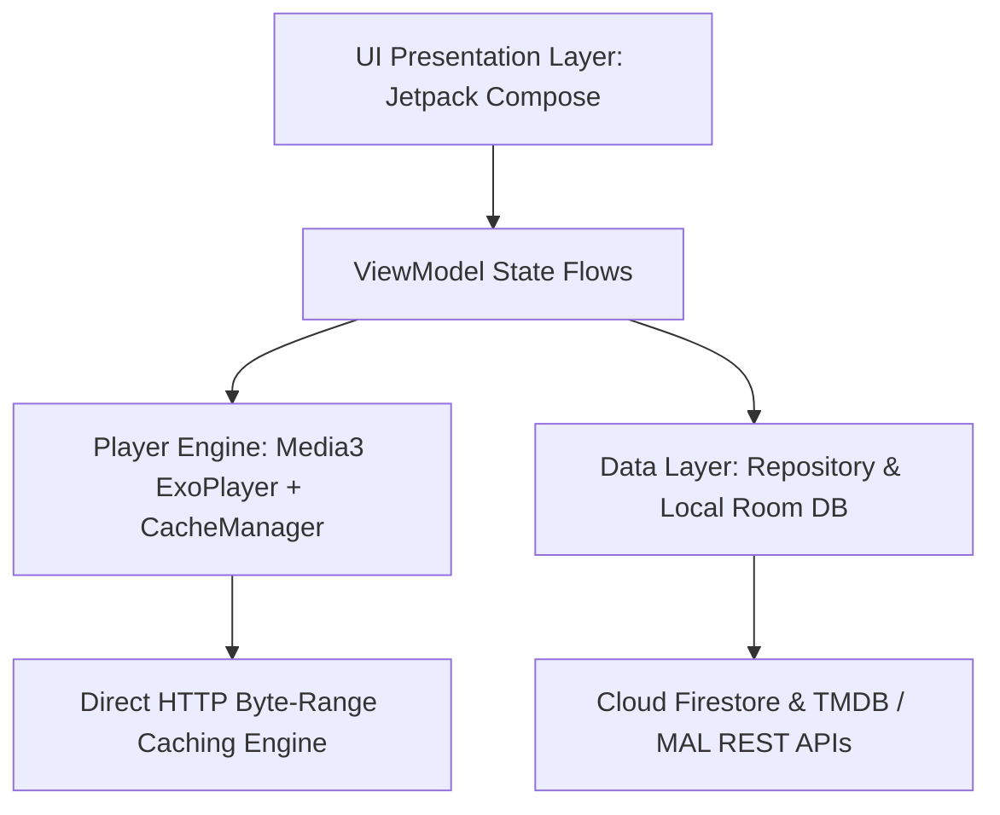

<p align="center">
  
</p>

<p align="center">
  <a href="https://github.com/WorkerOfArea51/StreamHub">
    
  </a>
</p>

<p align="center">
  <a href="https://github.com/WorkerOfArea51/StreamHub"></a>
  <a href="https://kotlinlang.org"></a>
  <a href="https://developer.android.com/jetpack/compose"></a>
  <a href="https://developer.android.com/media/media3"></a>
  <a href="https://firebase.google.com"></a>
  <a href="LICENSE"></a>
</p>

---

## ⚡ Overview

**StreamHub** is a bleeding-edge, high-performance native Android media streaming application built with **Kotlin 2.0**, **Jetpack Compose (Material 3)**, and **AndroidX Media3 ExoPlayer**. 

Engineered from the ground up for low latency, zero-login instant playback, aggressive byte-range disk caching, and a multi-season **Story Arc Creator Studio** with 1-click REST API batch ingestion.

---

## ✨ Key Highlights & Features

| 🚀 Feature | 💡 Description |
| :--- | :--- |
| **🎨 Material 3 Expressive UI** | Native 5-level dark tonal elevation (`surfaceContainer`), split-button navigation dock, borderless tactile pills (`CircleShape`), and clean vector iconography. |
| **⚡ Turbo HTTP Progressive Engine** | Sub-second playback initialization with byte-range requests and dynamic bitrate-proportional disk caching (`SimpleCache`). |
| **📦 Smart Batch Download & Queue** | High-throughput in-app OkHttp download engine (2–3+ MB/s), intelligent batch episode selector, sequential queue, and single branded notification. |
| **🌐 Live Online Subtitle Search** | OpenSubtitles & Cinemeta CDN integration with 1-tap player injection, live language filters, and real-time millisecond offset sync. |
| **🎬 Multi-Arc Story Hub** | Dedicated Arc-Level episode manager with automatic missing episode gap detection, 1-click F2L REST batch importer, and snippet insertion. |
| **🎧 Dual-Audio & Subtitle Master** | Embedded MKV multi-audio track switcher, subtitle track selector with audio/sub delay sync, and ASS/SSA anime typography styling. |
| **📺 Advanced Player HUD** | Fluid seekbar with chapter markers, 3-zone swipe gestures (brightness, volume boost up to 200%), hold-to-2x, pinch-to-zoom, and Picture-in-Picture. |
| **🏷️ Real-time MediaInfo Badges** | Dynamic resolution and codec badges (`4K UHD`, `1080p FHD`, `x264/AVC`, `HEVC/x265`, `Dual Audio`, `ESub`, `File Size`). |
| **📊 Live Audience Telemetry** | Real-time active viewer tracking, access tier breakdown, live device health inspector, and admin broadcast alerts. |
| **🎨 Dynamic Theming & Preferences** | 7 accent themes (AMOLED dark mode), structured contiguous preferences, volume normalization, and 1-click JSON Backup & Restore. |
| **🔒 VIP Access Gate & Admin Studio** | Private community gate on launch with secret 5-tap gesture unlock for Creator Studio in-app publishing. |

---

## 🛠️ Architecture & Tech Stack



- **Language**: Kotlin 2.0+ (Coroutine-first, Dispatchers.IO isolation)
- **UI Framework**: Pure Jetpack Compose with Material 3 Design Tokens
- **Video Engine**: AndroidX Media3 ExoPlayer (`media3-exoplayer`, `media3-ui`, `media3-datasource`)
- **Metadata Database**: Firebase Cloud Firestore (`firebase-firestore-ktx`)
- **Networking**: Retrofit 2 + OkHttp3 + Gson
- **Metadata Resolvers**: TMDB API v3 + Official MyAnimeList REST API v2 + Jikan Global Fallback
- **Image Pipeline**: Coil Compose with disk and memory cache
- **Security**: AndroidX Security Crypto (`EncryptedSharedPreferences`)

---

## 🎬 Creator Studio & In-App Publishing

StreamHub includes a built-in **Creator Studio** for catalog owners:
- **1-Click F2L REST API Importer**: Paste any batch link or ID (`/batch/...`) to ingest 300+ episodes across all arcs in seconds.
- **Smart Link & ID Resolver**: Paste direct MyAnimeList (`https://myanimelist.net/anime/...`) or TMDB (`https://www.themoviedb.org/tv/...`) URLs to auto-fetch high-res posters, banners, studios, cast, and trailers with 100% accuracy.
- **Story Arc Episode Manager**: Long-press any Story Arc in the sheet to inspect, edit JSON, detect missing episode gaps, and re-order episodes.

---

## 🔒 Private Access & Maintainer Contact

StreamHub includes a private community access gate on first launch. If you need an access invite or want to connect with the maintainer:

<p align="left">
  <a href="https://t.me/Londe_Lapate">
    
  </a>
</p>

---

## ☕ Support & Donations

If you enjoy StreamHub and want to support high-speed streaming nodes, server hosting costs, and ongoing development:

### 💰 Crypto Donations & Sponsorship:
If you would like to contribute or sponsor high-speed streaming nodes and server hosting costs:
- Reach out directly on Telegram: [@Londe_Lapate](https://t.me/Londe_Lapate) for donation wallet addresses (USDT/USDC - BEP20, TRC20) or alternative contribution methods.

---

## 🍴 Forking & Creating Your Own Custom App

StreamHub is designed so anyone can fork the repository and launch their own customized media streaming app. Follow these steps to configure your fork:

### 1. Database Setup (Firebase & Supabase)
- **Firebase Cloud Firestore (Default & Out-of-the-Box)**:
  1. Create a free project on the [Firebase Console](https://console.firebase.google.com/).
  2. Add an Android app with your package name (e.g. `com.streamhub.app`).
  3. Enable **Cloud Firestore** in test or production mode.
  4. Download `google-services.json` and place it inside the `app/` folder:
     ```text
     StreamHub/app/google-services.json
     ```
- **Supabase (Alternative Backend)**:
  - If you prefer to use **Supabase** instead of Firebase, you can implement a custom repository adapter in `app/.../data/repository/` to map your tables.
  - Alternatively, feel free to open a [GitHub Issue](https://github.com/WorkerOfArea51/StreamHub/issues) to request official out-of-the-box Supabase integration!

### 2. Configure API Keys (`local.properties`)
Create or edit `local.properties` in the root directory with your free metadata API keys:
```properties
# Free API key from https://www.themoviedb.org/settings/api (For movies & TV series metadata & posters)
streamhub.tmdb_api_key=YOUR_TMDB_API_KEY

# Free Client ID from https://myanimelist.net/apiconfig (For anime metadata & posters)
streamhub.mal_client_id=YOUR_MAL_CLIENT_ID
```

### 3. Set Your Admin & VIP Passwords (SHA-256 Security)
StreamHub uses cryptographic one-way **SHA-256 hashing** in code so that plaintext passwords are never stored in GitHub Secrets or exposed in the compiled APK binary.

1. **Generate the SHA-256 hash** for your desired password or PIN:
   - **Linux / macOS**:
     ```bash
     echo -n "YourSecretPassword" | sha256sum
     ```
   - **Windows PowerShell**:
     ```powershell
     [BitConverter]::ToString([System.Security.Cryptography.SHA256]::Create().ComputeHash([System.Text.Encoding]::UTF8.GetBytes("YourSecretPassword"))).Replace("-","").ToLower()
     ```
   - Or use any online SHA-256 calculator.

2. **Update the code hashes**:
   - **Creator Studio Admin Password** (`app/src/main/java/com/streamhub/app/data/AdminManager.kt`):
     ```kotlin
     const val MASTER_PASSWORD_SHA256 = "your_generated_sha256_hash_here"
     ```
   - **Community / Friends VIP Access Code** (`app/src/main/java/com/streamhub/app/data/AccessGateManager.kt`):
     ```kotlin
     private const val VIP_PERMANENT_CODE_SHA256 = "your_generated_sha256_hash_here"
     ```

### 4. Personalize App Branding
- **App Name**: Change `<string name="app_name">` in `app/src/main/res/values/strings.xml`.
- **Package ID**: Change `applicationId` in `app/build.gradle.kts`.
- **App Icons**: Replace launcher icons in `app/src/main/res/mipmap-*/`.

### 5. Automated CI/CD Releases via GitHub Actions (Optional)
If you want your fork to automatically build signed release APKs on push:
1. In your fork, navigate to **Settings > Secrets and variables > Actions**.
2. Add the following repository secrets:
   - `FIREBASE_GOOGLE_SERVICES_JSON`: Base64 encoded string or raw content of `google-services.json`
   - `RELEASE_KEYSTORE_BASE64`: Base64 encoded `.jks` or `.keystore` file
   - `RELEASE_KEYSTORE_PASSWORD`, `RELEASE_KEY_ALIAS`, `RELEASE_KEY_PASSWORD`: Keystore signing credentials
   - `STREAMHUB_TMDB_API_KEY`: Your TMDB API key
   - `STREAMHUB_MAL_CLIENT_ID`: Your MyAnimeList Client ID

*(Notice: No admin password secret is needed in GitHub Actions — authentication is handled securely via SHA-256 in code).*

---

## 📦 How to Build & Run Locally

### Prerequisites
- **JDK 17 or 21**
- **Android SDK 34/35** (Min SDK 24, Target SDK 35)

### 1. Clone Repository
```bash
git clone https://github.com/WorkerOfArea51/StreamHub.git
cd StreamHub
```

### 2. Build Debug APK
```bash
./gradlew assembleDebug
```

### 3. Build Signed Release APK
```bash
./gradlew assembleRelease
```

### 4. Install & Launch via ADB
```bash
adb install -r app/build/outputs/apk/debug/app-debug.apk
adb shell am start -n com.streamhub.app/.MainActivity
```

---

## 📄 License

This project is licensed under the [MIT License](LICENSE).

<p align="center">
  <sub>Crafted with ❤️ by <a href="https://github.com/WorkerOfArea51">WorkerOfArea51</a> and the StreamHub Community.</sub>
</p>
