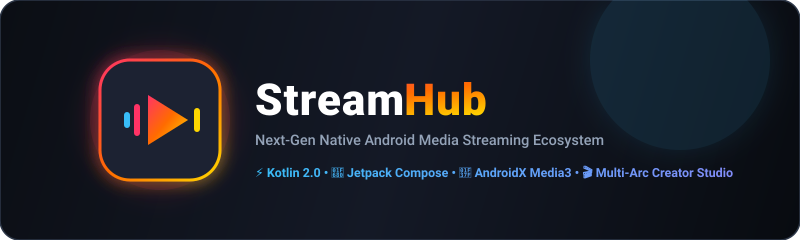
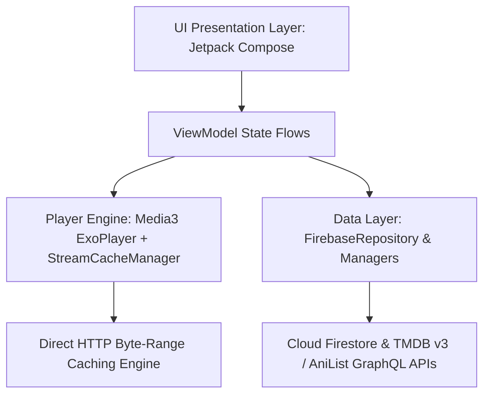

<p align="center">
  
</p>

<p align="center">
  <a href="https://github.com/WorkerOfArea51/StreamHub">
    
  </a>
</p>

<p align="center">
  <a href="https://github.com/WorkerOfArea51/StreamHub"></a>
  <a href="https://kotlinlang.org"></a>
  <a href="https://developer.android.com/jetpack/compose"></a>
  <a href="https://developer.android.com/media/media3"></a>
  <a href="https://firebase.google.com"></a>
  <a href="LICENSE"></a>
</p>

---

## ⚡ Overview

**StreamHub** is a bleeding-edge, high-performance native Android media streaming application built with **Kotlin 2.0**, **Jetpack Compose (Material 3)**, and **AndroidX Media3 ExoPlayer**. 

Engineered from the ground up for low latency, zero-login instant playback, aggressive byte-range disk caching, real-time AniList GraphQL & TMDB metadata auto-fetching, and a multi-season **Story Arc Creator Studio** with 1-click batch ingestion.

---

## ✨ Key Highlights & Features

| 🚀 Feature | 💡 Description |
| :--- | :--- |
| **🎨 Material 3 Expressive UI** | Native 5-level dark tonal elevation (`surfaceContainer`), split-button navigation dock, borderless tactile pills (`CircleShape`), and clean vector iconography. |
| **⚡ Turbo HTTP Progressive Engine** | Sub-second playback initialization with byte-range requests, 2 MB TCP window scaling, and dynamic bitrate-proportional disk caching (`SimpleCache`). |
| **🌸 AniList GraphQL Engine** | Zero-auth, sub-200ms anime metadata queries (`graphql.anilist.co`) fetching synopses, voice actors, high-res posters, banners, and trailers. |
| **📦 Smart Batch Download & Queue** | High-throughput in-app OkHttp download engine (2–3+ MB/s), intelligent batch episode selector, sequential queue, and single branded notification. |
| **🌐 Live Online Subtitle Search** | OpenSubtitles & Cinemeta CDN integration with 1-tap player injection, live language filters, and real-time millisecond offset sync. |
| **🎬 Multi-Arc Story Hub** | Dedicated Arc-Level episode manager with automatic missing episode gap detection, 1-click batch importer, and snippet insertion. |
| **🎧 Dual-Audio & Vocal Enhancement** | Embedded MKV multi-audio track switcher, hardware dialogue boost, night cinema mode, subtitle track selector with delay sync, and ASS/SSA styling. |
| **📺 XPlayer-Grade Immersion HUD** | Pure containerless corner countdown time, horizontal battery gauge, and live system clock that auto-hides during active full-screen video. |
| **⚠️ Nuvio-Grade Content Advisory** | Starts playback with signature vertical cyan indicator bar and stacked maturity category/severity rows. |
| **🎨 Nuvio-Grade Theming & Display** | 7 Classic solid themes, 6 Enhanced dual-tonal gradients, AMOLED black switch, customizable catalog grid density, and poster aspect ratios. |
| **🔒 Air-Tight Security & Admin Studio** | Cryptographic SHA-256 password protection, hardware-bound 30-day VIP vouchers, and verified server-side write gating. |

---

## 🛠️ Architecture & Tech Stack


```mermaid
graph TD
    A[UI Presentation Layer: Jetpack Compose] --> B[ViewModel State Flows]
    B --> C[Player Engine: Media3 ExoPlayer + StreamCacheManager]
    B --> D[Data Layer: FirebaseRepository & Managers]
    D --> E[Cloud Firestore & TMDB v3 / AniList GraphQL APIs]
    C --> F[Direct HTTP Byte-Range Caching Engine]
```

- **Language**: Kotlin 2.0+ (Coroutine-first, Dispatchers.IO isolation)
- **UI Framework**: Pure Jetpack Compose with Material 3 Design Tokens
- **Video Engine**: AndroidX Media3 ExoPlayer (`media3-exoplayer`, `media3-ui`, `media3-datasource`)
- **Metadata Database**: Firebase Cloud Firestore (`firebase-firestore-ktx`)
- **Networking**: Retrofit 2 + OkHttp3 + Gson + AniList GraphQL
- **Metadata Resolvers**: TMDB API v3 (Movies/Series) + Official AniList GraphQL API (Anime)
- **Image Pipeline**: Coil Compose with disk and memory cache
- **Security**: AndroidX Security Crypto (`EncryptedSharedPreferences`) + SHA-256 Verification

---

## 🎬 Creator Studio & In-App Publishing

StreamHub includes a built-in **Creator Studio** for catalog owners:
- **1-Click Batch Importer**: Ingest 300+ episodes across all arcs in seconds from direct server streams or batch dumps.
- **Smart Link & ID Resolver**: Paste direct AniList (`https://anilist.co/anime/...`) or TMDB (`https://www.themoviedb.org/tv/...`) URLs to auto-fetch high-res posters, banners, studios, cast, and trailers with 100% accuracy.
- **1-Tap Batch Catalog Migrator**: Bulk-update older anime catalogs to official AniList specs, Japanese voice actors, and high-res art with zero downtime.
- **Story Arc Episode Manager**: Inspect, edit JSON, detect missing episode gaps, and re-order episodes dynamically.

---

## 🔒 Private Access & Maintainer Contact

StreamHub includes a private community access gate on first launch. If you need an access invite or want to connect with the maintainer:

<p align="left">
  <a href="https://t.me/Londe_Lapate">
    
  </a>
</p>

---

## ☕ Support & Donations

If you enjoy StreamHub and want to support high-speed streaming nodes, server hosting costs, and ongoing development:

### 💰 Crypto Donations & Sponsorship:
If you would like to contribute or sponsor high-speed streaming nodes and server hosting costs:
- Reach out directly on Telegram: [@Londe_Lapate](https://t.me/Londe_Lapate) for donation wallet addresses (USDT/USDC - BEP20, TRC20) or alternative contribution methods.

---

## 🍴 Forking & Creating Your Own Custom App

StreamHub is designed so anyone can fork the repository and launch their own customized media streaming app. Follow these steps to configure your fork:

### 1. Database Setup (Firebase Cloud Firestore)
1. Create a free project on the [Firebase Console](https://console.firebase.google.com/).
2. Add an Android app with your package name (e.g. `com.streamhub.app`).
3. Enable **Cloud Firestore** in test or production mode.
4. Download `google-services.json` and place it inside the `app/` folder:
   ```text
   StreamHub/app/google-services.json
   ```

### 2. Configure API Keys (`local.properties`)
Create or edit `local.properties` in the root directory:
```properties
# Free API key from https://www.themoviedb.org/settings/api (For movies & TV series metadata & posters)
streamhub.tmdb_api_key=YOUR_TMDB_API_KEY

# Master Admin Password (For Creator Studio unlock)
streamhub.admin_master_password=YOUR_ADMIN_PASSWORD

# VIP Access Code (For permanent Community App Gate unlock)
streamhub.app_access_code=YOUR_VIP_ACCESS_CODE
```
*(Anime metadata is powered by AniList GraphQL which is 100% free and requires zero API keys).*

### 3. Set Your Admin & VIP Passwords (SHA-256 Security)
StreamHub uses cryptographic one-way **SHA-256 hashing** in code so that plaintext passwords are never stored in GitHub Secrets or exposed in the compiled APK binary.

1. **Generate the SHA-256 hash** for your desired password or PIN:
   - **Linux / macOS**:
     ```bash
     echo -n "YourSecretPassword" | sha256sum
     ```
   - **Windows PowerShell**:
     ```powershell
     [BitConverter]::ToString([System.Security.Cryptography.SHA256]::Create().ComputeHash([System.Text.Encoding]::UTF8.GetBytes("YourSecretPassword"))).Replace("-","").ToLower()
     ```

2. **Update the code hashes**:
   - **Creator Studio Admin Password** (`app/src/main/java/com/streamhub/app/data/AdminManager.kt`):
     ```kotlin
     const val MASTER_PASSWORD_SHA256 = "your_generated_sha256_hash_here"
     ```
   - **Community / Friends VIP Access Code** (`app/src/main/java/com/streamhub/app/data/AccessGateManager.kt`):
     ```kotlin
     private const val VIP_PERMANENT_CODE_SHA256 = "your_generated_sha256_hash_here"
     ```

### 4. Personalize App Branding
- **App Name**: Change `<string name="app_name">` in `app/src/main/res/values/strings.xml`.
- **Package ID**: Change `applicationId` in `app/build.gradle.kts`.
- **App Icons**: Replace launcher icons in `app/src/main/res/mipmap-*/`.

### 5. Automated CI/CD Releases via GitHub Actions (Optional)
If you want your fork to automatically build signed release APKs on push:
1. In your fork, navigate to **Settings > Secrets and variables > Actions**.
2. Add the following repository secrets:
   - `FIREBASE_GOOGLE_SERVICES_JSON`: Base64 encoded string or raw content of `google-services.json`
   - `RELEASE_KEYSTORE_BASE64`: Base64 encoded `.jks` or `.keystore` file
   - `RELEASE_KEYSTORE_PASSWORD`, `RELEASE_KEY_ALIAS`, `RELEASE_KEY_PASSWORD`: Keystore signing credentials
   - `STREAMHUB_TMDB_API_KEY`: Your TMDB API key

---

## 📦 How to Build & Run Locally

### Prerequisites
- **JDK 17 or 21**
- **Android SDK 34/35** (Min SDK 24, Target SDK 35)

### 1. Clone Repository
```bash
git clone https://github.com/WorkerOfArea51/StreamHub.git
cd StreamHub
```

### 2. Build Debug APK
```bash
./gradlew assembleDebug
```

### 3. Build Signed Release APK
```bash
./gradlew assembleRelease
```

### 4. Install & Launch via ADB
```bash
adb install -r app/build/outputs/apk/debug/StreamHub-arm64-debug.apk
adb shell am start -n com.streamhub.app.debug/com.streamhub.app.MainActivity
```

---

## 📄 License

This project is licensed under the [MIT License](LICENSE).

<p align="center">
  <sub>Crafted with ❤️ by <a href="https://github.com/WorkerOfArea51">WorkerOfArea51</a> and the StreamHub Community.</sub>
</p>
